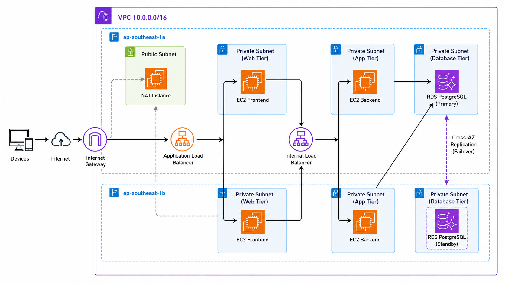

# Mini E-Wallet AWS 3-Tier Project

#Description
This project was built as a Cloud Engineer learning project to practice AWS infrastructure design and common tools.

The project was inspired by the recommendation that a Web 3-Tier Archititecture is a good starting point for understanding real-world cloud architecture.
I used this concept as a foundation, then designed, deployed, tested, and improved the system through hand-on practice.

The main objective is to understand how cloud compenets work together, including VPC, subnets. Security groups, ALB, internal load balancing, EC2, Docker, Jenkins, Grafana, Prometheus, Terraform and failure simulation

#Architecture Overview

#What I Built
Designed AWS Web 3-Tier Architecture
Provisioned AWS infrastructure using Infrastructure as Code (Terraform)
Created VPC, subnets, route tables, and security groups with Terraform modules
Deployed frontend and backend workloads on EC2 using Docker
Configured Internet-facing ALB for frontend traffic
Configured Internal Load Balancer (ILB) for backend traffic
Implemented Jenkins CI/CD workflow
Used Amazon ECR for Docker image registry
Set up Prometheus, Grafana, and Node Exporter for monitoring
Validated Web/App tier high availability by testing:
- ALB/ILB health checks
- Auto Scaling Group (ASG) self-healing
- AZ-level compute failure simulation

#Future Improvements
In the next phase, I plan to extend this project to learn container orchestration and GitOps practices.
Planned Improvements
Migrate Web/App workloads from EC2 Docker to Kubernetes
Deploy the application on Amazon EKS
Use Kubernetes Deployment, Service, Ingress, ConfigMap, and Secret
Implement GitOps CI/CD workflow using Argo CD
Add Horizontal Pod Autoscaler (HPA) for application scaling
Upgrade RDS to Multi-AZ and test database failover
Improve centralized logging and alerting
